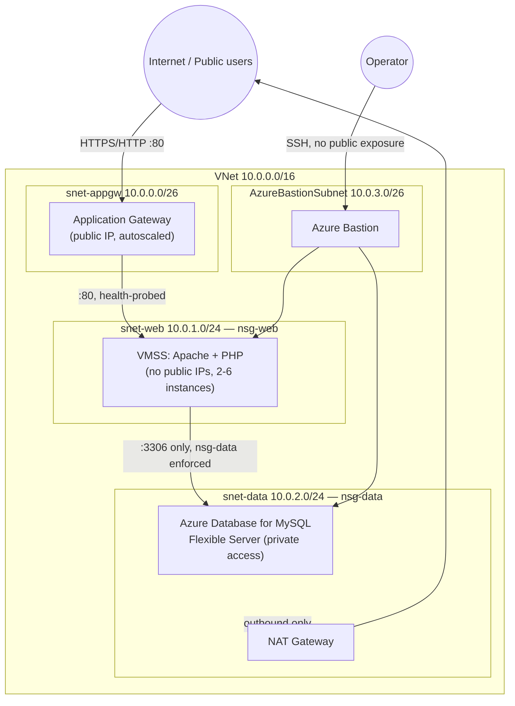

# Aabha — multi-tier restaurant booking reference project

A single-page restaurant website with a table-reservation form, a PHP
backend API, and a MySQL database — built specifically as a learning
project for **multi-tier hosting on Azure**: public edge tier, private
application tier, and an isolated private data tier, wired together with
a NAT Gateway, NSGs, an Application Gateway, and VMSS autoscaling.

```
project/
├── frontend/
│   └── index.html          # the whole public site (HTML/CSS/JS, no build step)
├── backend/
│   ├── config.php          # reads DB settings from environment variables
│   ├── db.php               # PDO connection helper
│   └── api/
│       ├── booking.php     # POST endpoint the reservation form calls
│       └── health.php      # health probe used by the Application Gateway
├── database/
│   └── schema.sql          # bookings table + least-privilege app user
├── infra/
│   ├── main.bicep          # the entire Azure architecture
│   ├── main.parameters.example.json
│   └── deploy.sh
└── README.md
```

## Architecture



**Tier 1 — Edge (`snet-appgw`):** an Application Gateway with a public
IP is the only internet-facing component. It terminates HTTP, health-checks
the backend pool at `/api/health.php`, and load-balances across the VMSS
instances. Its own autoscale range is 2-5 gateway capacity units.

**Tier 2 — Application (`snet-web`):** a Virtual Machine Scale Set running
Ubuntu + Apache + PHP. Instances have **no public IPs** — `nsg-web` only
allows inbound traffic on port 80 from the Application Gateway subnet
(`10.0.0.0/26`), nothing else, and denies all other inbound including
direct Internet access. The app code (this repo's `frontend/` and
`backend/`) is baked in at deploy time via cloud-init. Autoscale rules
add/remove instances based on average CPU (scale out >70%, scale in <25%).

**Tier 3 — Data (`snet-data`):** Azure Database for MySQL Flexible Server,
deployed with **VNet injection** (no public endpoint at all). `nsg-data`
allows inbound MySQL (3306) only from the app subnet's address range and
denies everything else, including the Internet. Because this subnet has
no public IP of its own, a **NAT Gateway** gives it outbound-only Internet
access (for OS/security patching) without ever accepting inbound
connections from the outside.

**Admin access:** Azure Bastion sits in its own subnet and is the only
way to SSH into VMSS instances or jump to the DB tier — there is no
public SSH anywhere in this design.

## How a booking request flows

1. Browser loads `index.html` from the Application Gateway's public IP.
2. The reservation form `POST`s JSON to `/api/booking.php`, which the
   Application Gateway forwards to a healthy VMSS instance.
3. `booking.php` validates the input, then writes a row to the `bookings`
   table over the private network path (`snet-web` → `snet-data`, port
   3306 only).
4. The API responds with a JSON reservation reference, which the page
   shows on the "reservation card".

## Local development (no Azure required)

You can run the app on a laptop against a local MySQL instance before
touching Azure at all:

```bash
# 1. Create the database
mysql -u root -p < database/schema.sql
mysql -u root -p -e "CREATE USER 'restaurant_app'@'%' IDENTIFIED BY 'localpass';
                      GRANT SELECT, INSERT, UPDATE ON restaurant_db.* TO 'restaurant_app'@'%';"

# 2. Point the backend at it
export DB_HOST=127.0.0.1
export DB_NAME=restaurant_db
export DB_USER=restaurant_app
export DB_PASS=localpass
export APP_ENV=development
export ALLOWED_ORIGIN=*

# 3. Serve frontend + backend together with PHP's built-in server
cd frontend && cp -r ../backend/* . && php -S localhost:8080
```

Open `http://localhost:8080` and submit a reservation — it should insert
a row into `bookings` and return a reference code.

## Deploying to Azure

```bash
cd infra
cp main.parameters.example.json main.parameters.json
# edit main.parameters.json:
#  - adminSshPublicKey  -> contents of ~/.ssh/your_key.pub
#  - mysqlAdminPassword -> a strong password
#  - appDbPassword      -> a strong password (used by the PHP app at runtime)

./deploy.sh
```

This provisions, in order: the VNet and subnets, NSGs, the NAT Gateway,
the private DNS zone + MySQL Flexible Server, the Application Gateway,
and the VMSS (which bootstraps the app via cloud-init on first boot).
Expect roughly 20-30 minutes, mostly waiting on the MySQL Flexible Server.

After the deployment finishes:

1. Connect via Bastion to any VMSS instance (or use `az mysql flexible-server connect`
   from a VM in the VNet) and create the least-privilege app user from
   `database/schema.sql`, using the same password you put in `appDbPassword`:
   ```sql
   CREATE USER 'restaurant_app'@'%' IDENTIFIED BY 'the-appDbPassword-you-chose';
   GRANT SELECT, INSERT, UPDATE ON restaurant_db.* TO 'restaurant_app'@'%';
   FLUSH PRIVILEGES;
   ```
2. Run `database/schema.sql` against the server to create the `bookings` table.
3. Grab the Application Gateway's public IP from the deployment output and
   open it in a browser.

## What's deliberately simplified (and how to harden it for real use)

- **TLS**: the Application Gateway listens on plain HTTP for clarity.
  Add an HTTPS listener with a certificate (Key Vault-backed) and redirect
  HTTP → HTTPS.
- **Secrets**: `mysqlAdminPassword` and `appDbPassword` are plain secure
  parameters and end up in VMSS `customData`. For production, use Azure
  Key Vault + Key Vault references (or Managed Identity + Azure AD auth
  to MySQL) instead.
- **WAF**: switch the Application Gateway SKU from `Standard_v2` to
  `WAF_v2` and enable a managed rule set for real internet exposure.
- **CORS**: `backend/config.php`'s `ALLOWED_ORIGIN` defaults to `*` —
  set it to your real domain via the `ALLOWED_ORIGIN` app setting.
- **CI/CD**: app code is baked into VMSS images/cloud-init at deploy
  time here for simplicity. A real setup would build a custom VM image
  (or containerize with Azure Container Apps / AKS) and roll it out
  through a pipeline instead of re-running the whole Bicep deployment.

## Cleaning up

```bash
az group delete --name rg-aabha-dev --yes --no-wait
```
